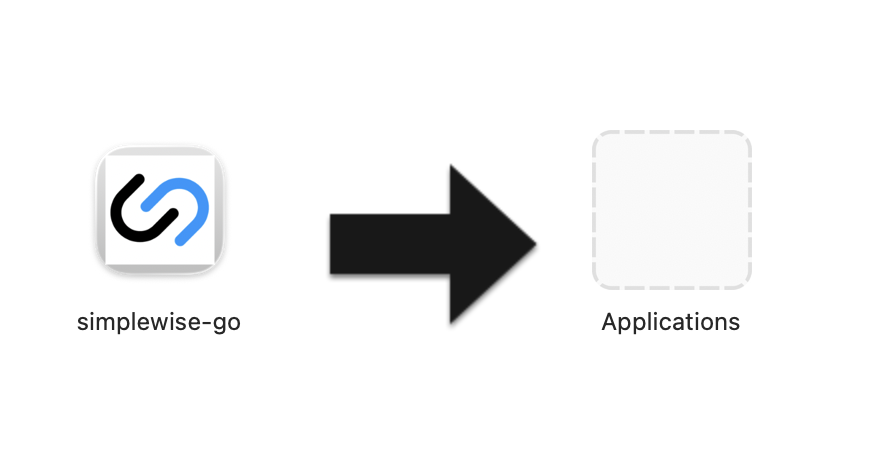

# Simplewise Go Download

## About Simplewise Go

Simplewise Go is a software application that enables local AI model downloads and management. This tool provides an interface for downloading and working with various AI models, including Llama models from Meta.

## Installation (macOS)

To install Simplewise Go on macOS, follow these steps:

### Step 1: Install the App

Download and install Simplewise Go by dragging the application to your Applications folder.



### Step 2: Remove Quarantine Attribute

Since this is an unsigned app, macOS adds a quarantine flag (`com.apple.quarantine`) when downloading. To remove this flag, open Terminal and run:

```bash
xattr -cr "/Applications/simplewise-go.app"
```

This command removes the quarantine attribute, allowing the app to run without macOS security warnings.

## Commercial License

**Copyright © Simplewise AS**

This software is proprietary and confidential. All rights reserved.

**Standard Commercial License Terms:**

- Use of this software without explicit written consent and approval from Simplewise AS is not valid and is strictly prohibited.
- This software is provided under a commercial license agreement.
- Unauthorized use, distribution, modification, or reverse engineering of this software is prohibited.
- For licensing inquiries, please contact Simplewise AS.

## Credits

### Ollama

This project utilizes [Ollama](https://ollama.ai/), an open-source tool for running large language models locally. Ollama provides the infrastructure for downloading, managing, and running AI models on your local machine.

### AI Models

This software supports the following AI models:

#### Llama 3.2 1B (`llama3.2:1b`)

- **Parameters:** 1B
- **Context Length:** 128K
- **Size:** 1.3GB
- **Description:** Smaller, faster Llama 3.2 variant optimized for low-latency and resource-constrained devices.
- **Device Specification:** Recommended: ≥8 GB RAM, modern 4-core CPU; runs on most recent laptops without GPU.
- **License:** [Llama Community License](https://llama.meta.com/llama3/license/)
- **Capabilities:** Text generation, Tool use

#### Llama 3.2 3B (`llama3.2:3b`)

- **Parameters:** 3B
- **Context Length:** 128K
- **Size:** 2GB
- **Description:** Larger Llama 3.2 variant with higher quality reasoning and generation at the cost of more compute.
- **Device Specification:** Recommended: ≥16 GB RAM, modern 8-core CPU; benefits from dedicated GPU or Apple Silicon.
- **License:** [Llama Community License](https://llama.meta.com/llama3/license/)
- **Capabilities:** Text generation, Tool use

**Model Credits:** These models are provided by Meta under the Llama Community License. For more information, visit [Meta's Llama website](https://llama.meta.com/).

---

**Owner:** Simplewise AS
