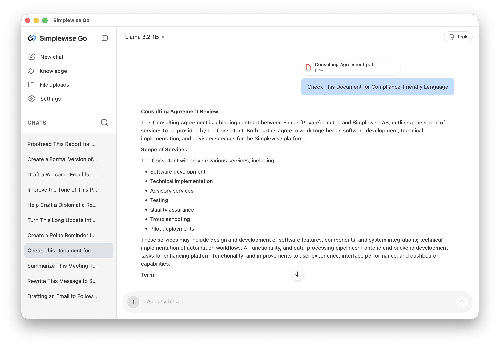
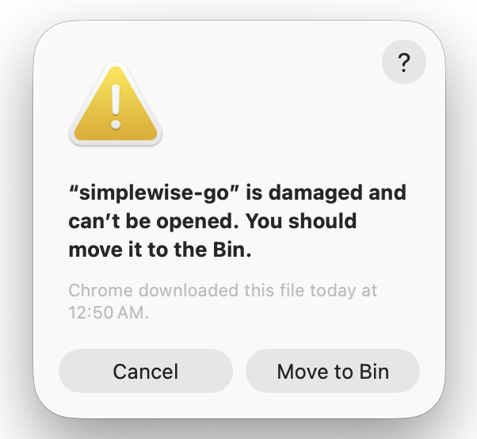

# Simplewise Go

**Simplewise Go — Your Private, On-Device AI Assistant**

90% of the power for everyday tasks — with 0% data sharing.

All processing happens on your laptop, giving you 100% data privacy and full compliance with strict security and regulatory requirements.

Simplewise Go uses lightweight micro-LLMs tailored for different industries and workflows. This provides practical AI support without cloud services or heavy hardware.



## Installation (macOS)

To install Simplewise Go on macOS, follow these steps:

### Step 1: Install the App

Download and install Simplewise Go by dragging the application to your Applications folder.


### Step 2: Remove Quarantine Attribute

When you try to open the app after installation, you may see an error message saying the app is "damaged" or cannot be opened. This happens because macOS adds a quarantine flag (`com.apple.quarantine`) when downloading unsigned apps.



To fix this, open Terminal and run:

```bash
xattr -cr "/Applications/simplewise-go.app"
```

This command removes the quarantine attribute, allowing the app to run without macOS security warnings. After running this command, you should be able to open Simplewise Go normally.

### Step 3: Close Ollama Process (if needed)

If you need to close the Ollama process (for example, if it's already running on port 11400), you can use the following command in Terminal:

```bash
lsof -ti:11400 | xargs kill -9
```

This command finds any process using port 11400 (Ollama's default port) and terminates it.

## Commercial License

**Copyright © Simplewise AS**

This software is proprietary and confidential. All rights reserved.

**Standard Commercial License Terms:**

- Use of this software without explicit written consent and approval from Simplewise AS is not valid and is strictly prohibited.
- This software is provided under a commercial license agreement.
- Unauthorized use, distribution, modification, or reverse engineering of this software is prohibited.
- For licensing inquiries, please contact Simplewise AS.

## Credits

### Ollama

This project utilizes [Ollama](https://ollama.ai/), an open-source tool for running large language models locally. Ollama provides the infrastructure for downloading, managing, and running AI models on your local machine.

### AI Models

This software supports the following AI models:

#### Gemma3n E2B (`gemma3n:e2b`)

- **Parameters:** 6B (effective 2B)
- **Context Length:** 32K
- **Size:** 5.6GB
- **Quantization:** Q4_K_M
- **Description:** Multimodal Gemma3n model designed for everyday devices. Supports text, image, audio, and video inputs with text outputs. Uses selective parameter activation for reduced resource requirements. Trained on data in over 140 languages.
- **Device Specification:** Recommended: ≥8 GB RAM, modern 4-core CPU; runs on most recent laptops.
- **License:** [Gemma Terms of Use](https://ai.google.dev/gemma/terms)
- **Capabilities:** Text generation, Vision (image, audio, video inputs)

#### EmbeddingGemma 300M (`embeddinggemma:300m`)

- **Parameters:** 300M
- **Context Length:** 8K
- **Size:** 200MB
- **Quantization:** BF16
- **Description:** 300M parameter embedding model from Google.
- **Device Specification:** Recommended: ≥2 GB RAM, any modern CPU; runs on almost any device.
- **License:** [Gemma Terms of Use](https://ai.google.dev/gemma/terms)
- **Capabilities:** Text embeddings

**Model Credits:** These models are provided by Google under the Gemma Terms of Use. For more information, visit [Google's Gemma website](https://ai.google.dev/gemma/).

---

**Owner:** Simplewise AS
